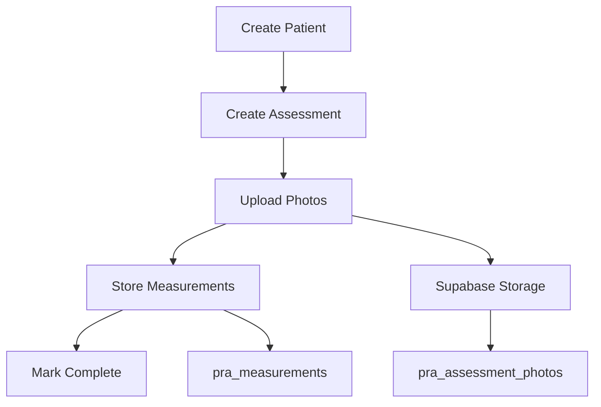
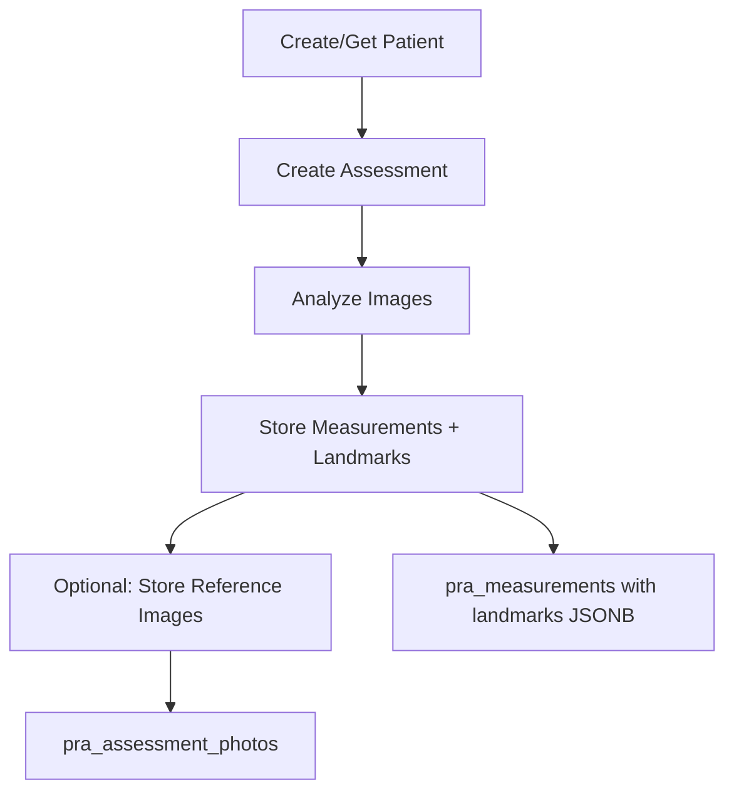

# Complete Data Flow Fix Implementation Guide

## Overview
This guide provides step-by-step implementation instructions for fixing all data collection, storage, and display issues in the Posture AI application.

## 🚨 Issues Summary

### Quick Mode Issues
- **Photo Display**: Uploaded images not showing due to missing CSS and race condition

### Clinical Assessment Issues  
- **Photos Not Collected**: No 'assessment' case in `collectCurrentTabData()`
- **Photos Not Stored**: `UIState.analysisData.clinical.photos` remains empty
- **Annotations Lost**: Photo annotation textareas never captured

### Advanced Analysis Issues
- **Images Not Stored**: Original images never saved in UIState
- **Data Format Mismatch**: Frontend stores raw values, backend expects `measurements` array
- **Landmarks Not Preserved**: MediaPipe data used for drawing but not saved

## 📋 Implementation Plan

### Phase 1: Foundation Fixes (Immediate)

#### Fix 1: Add CSS for Uploaded Images
**File**: `assets/css/styles.css`
**Location**: Add after line ~1100 (near other image styles)

```css
/* ========== Uploaded Images ========== */
.uploaded-image {
    width: 100%;
    height: 100%;
    max-width: 100%;
    max-height: 100%;
    object-fit: contain;
    border-radius: var(--border-radius-lg);
    background: var(--color-bg-secondary);
    opacity: 0.95;
    transition: opacity 0.3s ease;
    display: block;
}

.uploaded-image.loading {
    opacity: 0.5;
}

.camera-container .uploaded-image {
    position: absolute;
    top: 0;
    left: 0;
    right: 0;
    bottom: 0;
}

/* Ensure proper display in preview containers */
#quick-preview,
#clinical-front-preview,
#clinical-side-preview,
#clinical-back-preview,
#advanced-front-preview,
#advanced-side-preview,
#advanced-back-preview {
    width: 100%;
    height: 100%;
    object-fit: contain;
}
```

#### Fix 2: Fix Image Loading Race Condition
**File**: `assets/js/ui-controller.js`
**Function**: `displayUploadedImage()` (around line 564)

```javascript
function displayUploadedImage(imageSrc, mode, view = null) {
    try {
        console.log(`Displaying uploaded image for ${mode} mode${view ? ` - ${view} view` : ''}`);
        
        // Determine preview element ID
        const identifier = mode === 'quick' ? 'quick' : 
                          mode === 'clinical' ? `clinical-${view}` : 
                          `advanced-${view}`;
        
        const preview = document.getElementById(`${identifier}-preview`);
        if (!preview) {
            console.error(`Preview element not found: ${identifier}-preview`);
            return;
        }
        
        // Create new image to validate before displaying
        const img = new Image();
        
        // Set handlers BEFORE setting src to avoid race condition
        img.onload = function() {
            console.log(`Image loaded successfully: ${this.width}x${this.height}`);
            
            // Check image dimensions
            if (this.width < 200 || this.height < 200) {
                showNotification('Image too small. Please use an image at least 200x200 pixels.', 'error');
                return;
            }
            
            // Display the image
            preview.src = imageSrc;
            preview.classList.remove('hidden');
            preview.style.display = 'block'; // Ensure visibility
            
            // Store image in UIState for advanced mode
            if (mode === 'advanced') {
                if (!UIState.analysisData.advanced.images) {
                    UIState.analysisData.advanced.images = {};
                }
                UIState.analysisData.advanced.images[view] = {
                    imageData: imageSrc,
                    filename: 'uploaded-image.jpg',
                    uploadTime: new Date().toISOString(),
                    dimensions: {
                        width: this.width,
                        height: this.height
                    }
                };
                console.log(`Advanced mode: Stored ${view} image in UIState`);
            }
            
            // Update UI based on mode
            if (mode === 'quick') {
                updateQuickModeUI(true);
            } else if (mode === 'clinical') {
                updateClinicalPhotoStatus(view, true);
            } else if (mode === 'advanced') {
                updateAdvancedViewStatus(view, true);
                checkAdvancedAutoAnalysis();
            }
            
            showNotification(`${view ? view.charAt(0).toUpperCase() + view.slice(1) : 'Image'} uploaded successfully`, 'success');
        };
        
        img.onerror = function() {
            console.error('Failed to load image');
            showNotification('Invalid or corrupted image file. Please try another image.', 'error');
        };
        
        // NOW set src after handlers are attached
        img.src = imageSrc;
        
    } catch (error) {
        console.error('Error displaying uploaded image:', error);
        showNotification('Failed to display image: ' + error.message, 'error');
    }
}
```

#### Fix 3: Initialize UIState.analysisData.advanced.images
**File**: `assets/js/ui-controller.js`
**Location**: UIState declaration (around line 26)

```javascript
export const UIState = {
    currentMode: null,
    currentTab: null,
    pose: null,
    enhancedDetector: null,
    currentStream: null,
    analysisData: {
        quick: {},
        clinical: {
            clientInfo: {},
            photos: {},
            movements: {}
        },
        advanced: {
            front: null,
            side: null,
            back: null,
            images: {},      // ADD THIS
            landmarks: {},   // ADD THIS
            patterns: []     // ADD THIS
        }
    },
    uploadedViews: {
        clinical: {
            front: false,
            side: false,
            back: false
        },
        advanced: {
            front: false,
            side: false,
            back: false
        }
    }
};
```

### Phase 2: Clinical Assessment Data Collection

#### Fix 4: Add Assessment Tab Data Collection ✅ COMPLETED BY TEAM 2
**File**: `assets/js/ui-controller.js`
**Function**: `collectCurrentTabData()` (around line 1922)
**Location**: Add after line 1933 in the switch statement
**Status**: ✅ IMPLEMENTED - Clinical photos now collected with annotations on every tab switch

```javascript
case 'assessment':
    // Collect photo data and annotations
    const photoData = {};
    ['front', 'side', 'back'].forEach(view => {
        const preview = document.getElementById(`clinical-${view}-preview`);
        const annotationTextarea = document.querySelector(`#clinical-${view}-card textarea`);
        
        if (preview && !preview.classList.contains('hidden') && preview.src && preview.src !== window.location.href) {
            photoData[view] = {
                imageData: preview.src,  // Base64 data URL
                annotation: annotationTextarea?.value || '',
                uploaded: true,
                timestamp: new Date().toISOString()
            };
            console.log(`Collected ${view} photo with annotation: "${annotationTextarea?.value || 'none'}"`);
        }
    });
    
    // Store in UIState
    UIState.analysisData.clinical.photos = photoData;
    console.log('Clinical photos collected:', Object.keys(photoData));
    
    // Also update upload status
    Object.keys(photoData).forEach(view => {
        UIState.uploadedViews.clinical[view] = true;
    });
    break;
```

#### Fix 5: Collect Data on Tab Switch ✅ COMPLETED BY TEAM 2
**File**: `assets/js/ui-controller.js`
**Function**: `showTab()` (around line 367)
**Location**: Add after hiding previous tab content
**Status**: ✅ IMPLEMENTED - Zero data loss during tab navigation with comprehensive logging

```javascript
function showTab(tabName) {
    // Get current tab before switching
    const previousTab = UIState.currentTab;
    
    // Hide all tab contents
    document.querySelectorAll('.tab-content').forEach(tab => {
        tab.classList.add('hidden');
    });
    
    // Remove active class from all tabs
    document.querySelectorAll('.tab-button').forEach(btn => {
        btn.classList.remove('active');
    });
    
    // Save data from previous tab before switching
    if (previousTab && previousTab !== tabName) {
        collectCurrentTabData(previousTab);
        console.log(`Collected data from ${previousTab} tab before switching to ${tabName}`);
    }
    
    // Show selected tab
    const selectedTab = document.getElementById(`${tabName}-tab`);
    if (selectedTab) {
        selectedTab.classList.remove('hidden');
        // Find and activate the corresponding button
        const tabButton = document.querySelector(`[data-tab="${tabName}"]`);
        if (tabButton) {
            tabButton.classList.add('active');
        }
    }
    
    UIState.currentTab = tabName;
}
```

### Phase 3: Advanced Analysis Data Transformation

#### Fix 6: Update processAdvancedResults for Measurements Array ✅ COMPLETED BY TEAM 2
**File**: `assets/js/ui-controller.js`
**Function**: `processAdvancedResults()` (around line 1033)
**Status**: ✅ IMPLEMENTED - Complete data transformation with database-compatible measurements array format

```javascript
function processAdvancedResults(results, view) {
    if (!results.poseLandmarks) {
        showNotification(`No pose detected in ${view} view`, 'warning');
        return;
    }
    
    // Store raw landmarks for future use
    if (!UIState.analysisData.advanced.landmarks) {
        UIState.analysisData.advanced.landmarks = {};
    }
    UIState.analysisData.advanced.landmarks[view] = results.poseLandmarks;
    
    // Analyze based on view
    let analysis;
    switch (view) {
        case 'front':
            analysis = analyzeFrontView(results.poseLandmarks);
            break;
        case 'side':
            analysis = analyzeSideView(results.poseLandmarks);
            break;
        case 'back':
            analysis = analyzeBackView(results.poseLandmarks);
            break;
    }
    
    // Convert to database format with measurements array
    const measurements = [];
    if (analysis) {
        Object.entries(analysis).forEach(([key, value]) => {
            if (typeof value === 'number' && key !== 'totalDeviation' && key !== 'view') {
                measurements.push({
                    name: key,
                    type: key,  // Both for compatibility
                    value: value,
                    unit: key.includes('Angle') || key.includes('angle') ? 'degrees' : 
                          key.includes('Asymmetry') || key.includes('asymmetry') ? 'mm' : 
                          key.includes('Head') || key.includes('head') ? 'cm' : 'units',
                    confidence: 0.85,
                    viewType: view
                });
            }
        });
        
        // Handle special cases like weight distribution
        if (analysis.weightDistribution) {
            measurements.push(
                {
                    name: 'weightDistributionLeft',
                    type: 'weight_distribution_left',
                    value: analysis.weightDistribution.left,
                    unit: 'percent',
                    confidence: 0.8,
                    viewType: view
                },
                {
                    name: 'weightDistributionRight',
                    type: 'weight_distribution_right',
                    value: analysis.weightDistribution.right,
                    unit: 'percent',
                    confidence: 0.8,
                    viewType: view
                }
            );
        }
    }
    
    // Store both formats for compatibility
    UIState.analysisData.advanced[view] = {
        ...analysis,
        measurements: measurements,
        confidence: results.confidence || 0.85,
        stability: results.stability || 1.0,
        timestamp: new Date().toISOString()
    };
    
    console.log(`Processed ${view} view with ${measurements.length} measurements`);
    
    // Update UI display (existing code continues...)
    const resultsContainer = document.getElementById(`advanced-${view}-results`);
    if (resultsContainer && analysis) {
        displayAdvancedResults(resultsContainer, analysis, view);
    }
    
    // Update status
    updateAdvancedViewStatus(view, true, true);
    
    // Check if all views are analyzed
    checkAdvancedCompletion();
}
```

### Phase 4: Database Service Updates

#### Fix 7: Update Database Service for Both Formats
**File**: `assets/js/database-service.js`
**Function**: `storeAnalysisResults()` (around line 136)

```javascript
} else if (analysisData.mode === 'advanced') {
    // Advanced mode - process each view
    ['front', 'side', 'back'].forEach(view => {
        const viewData = analysisData[view];
        if (viewData) {
            // Handle both old format (direct properties) and new format (measurements array)
            if (viewData.measurements && Array.isArray(viewData.measurements)) {
                // New format - use directly
                viewData.measurements.forEach(m => {
                    measurements.push({
                        type: m.type || m.name,  // Handle both property names
                        value: parseFloat(m.value),
                        unit: m.unit || 'degrees',
                        confidence: m.confidence || 0.9,
                        viewType: view
                    });
                });
            } else {
                // Old format - convert properties to measurements
                Object.entries(viewData).forEach(([key, value]) => {
                    if (typeof value === 'number' && 
                        key !== 'totalDeviation' && 
                        key !== 'confidence' && 
                        key !== 'stability') {
                        measurements.push({
                            type: key,
                            value: parseFloat(value),
                            unit: key.includes('Angle') || key.includes('angle') ? 'degrees' : 
                                  key.includes('Asymmetry') || key.includes('asymmetry') ? 'mm' : 
                                  key.includes('Head') || key.includes('head') ? 'cm' : 'units',
                            confidence: viewData.confidence || 0.85,
                            viewType: view
                        });
                    }
                });
                
                // Handle weight distribution special case
                if (viewData.weightDistribution) {
                    measurements.push(
                        {
                            type: 'weight_distribution_left',
                            value: viewData.weightDistribution.left,
                            unit: 'percent',
                            confidence: 0.8,
                            viewType: view
                        },
                        {
                            type: 'weight_distribution_right',
                            value: viewData.weightDistribution.right,
                            unit: 'percent',
                            confidence: 0.8,
                            viewType: view
                        }
                    );
                }
            }
        }
    });
    
    // Add any detected patterns
    if (analysisData.patterns && Array.isArray(analysisData.patterns)) {
        patterns = analysisData.patterns;
    }
}
```

### Phase 5: Complete Integration

#### Fix 10: Save Exercise Prescriptions to Database
**File**: `assets/js/database-service.js`
**Function**: `saveCompleteAssessment()` (around line 257)
**Location**: Add after storing analysis results

```javascript
// After line 286 (await storeAnalysisResults...)
// Store exercise prescriptions if this is a clinical assessment
if (assessmentData.mode === 'clinical' && assessment.id) {
    const prescriptionData = {
        release: assessmentData.release || {},
        reset: assessmentData.reset || {},
        rebuild: assessmentData.rebuild || {}
    };
    
    // Check if we have any exercises to save
    const hasExercises = 
        (prescriptionData.release.exercises?.length > 0) ||
        (prescriptionData.reset.exercises?.length > 0) ||
        (prescriptionData.rebuild.exercises?.length > 0);
    
    if (hasExercises) {
        // Create prescription record
        const { data: prescription, error: prescError } = await supabase
            .from('pra_exercise_prescriptions')
            .insert({
                assessment_id: assessment.id,
                prescribed_by: assessmentData.clinician_id || null,
                prescription_date: new Date().toISOString().split('T')[0],
                sessions_per_week: 3, // Default, could be made configurable
                duration_weeks: parseInt(prescriptionData.rebuild.progression) || 6,
                notes: [
                    prescriptionData.release.notes,
                    prescriptionData.reset.notes,
                    prescriptionData.rebuild.notes
                ].filter(n => n).join('\n\n')
            })
            .select()
            .single();
        
        if (!prescError && prescription) {
            // Store individual exercises
            const exercisePromises = [];
            
            // Process each category
            ['release', 'reset', 'rebuild'].forEach(category => {
                const exercises = prescriptionData[category].exercises || [];
                exercises.forEach((exercise, index) => {
                    exercisePromises.push(
                        supabase.from('pra_prescribed_exercises').insert({
                            prescription_id: prescription.id,
                            exercise_category: category,
                            exercise_name: exercise.name,
                            sets: exercise.sets || 3,
                            reps: exercise.reps || 10,
                            hold_seconds: exercise.hold || 5,
                            frequency_per_day: exercise.frequency || 1,
                            instructions: exercise.description || '',
                            sort_order: index
                        })
                    );
                });
            });
            
            // Execute all exercise inserts
            if (exercisePromises.length > 0) {
                const exerciseResults = await Promise.all(exercisePromises);
                const exerciseErrors = exerciseResults.filter(r => r.error);
                if (exerciseErrors.length > 0) {
                    console.error('Some exercises failed to save:', exerciseErrors);
                }
            }
            
            console.log(`Saved ${exercisePromises.length} exercises for prescription ${prescription.id}`);
        }
    }
}
```

### Phase 5: Complete Integration

#### Fix 8: Update Clinical Save with Photos
**File**: `assets/js/ui-controller.js`
**Function**: `saveClinicalAssessment()` (around line 2070)

```javascript
async function saveClinicalAssessment() {
    try {
        showLoading('Saving clinical assessment...');
        
        // Ensure we have the latest photo data
        collectCurrentTabData('assessment');
        
        // Collect all data
        const assessmentData = {
            mode: 'clinical',
            timestamp: new Date().toISOString(),
            ...UIState.analysisData.clinical
        };
        
        // Prepare photo data for database (compress if needed)
        const photoDataForDB = {};
        let hasPhotos = false;
        
        Object.entries(UIState.analysisData.clinical.photos || {}).forEach(([view, data]) => {
            if (data && data.imageData) {
                // For MVP, limit image size to prevent API timeout
                // In production, use separate photo upload endpoint
                const maxLength = 100000; // ~75KB after base64
                photoDataForDB[view] = {
                    imageData: data.imageData.length > maxLength ? 
                              data.imageData.substring(0, maxLength) + '...[truncated]' : 
                              data.imageData,
                    annotation: data.annotation || '',
                    timestamp: data.timestamp
                };
                hasPhotos = true;
            }
        });
        
        // Add photos to assessment data if available
        if (hasPhotos) {
            assessmentData.photos = photoDataForDB;
            console.log('Including photos in assessment save');
        }
        
        // If patient exists, save to database
        if (UIState.currentPatientId) {
            try {
                const result = await saveCompleteAssessment({
                    ...assessmentData,
                    patientId: UIState.currentPatientId
                });
                
                if (result.success) {
                    showNotification('Assessment saved to database successfully!', 'success');
                    console.log('Database save result:', result);
                }
            } catch (dbError) {
                console.error('Database save failed:', dbError);
                showNotification('Database save failed, but local file was saved', 'warning');
            }
        }
        
        // Always save locally as backup
        downloadJSON(assessmentData, 'clinical-assessment');
        
        // Generate PDF report
        generatePDF(assessmentData);
        
        hideLoading();
        showNotification('Clinical assessment saved successfully!', 'success');
        
    } catch (error) {
        hideLoading();
        console.error('Error saving clinical assessment:', error);
        showNotification('Failed to save assessment: ' + error.message, 'error');
    }
}
```

#### Fix 9: Update Export Biomechanics
**File**: `assets/js/ui-controller.js`
**Function**: `exportBiomechanics()` (around line 1810)

```javascript
function exportBiomechanics() {
    try {
        const exportData = {
            timestamp: new Date().toISOString(),
            mode: 'advanced',
            analysisData: UIState.analysisData.advanced,
            images: UIState.analysisData.advanced.images || {},
            landmarks: UIState.analysisData.advanced.landmarks || {},
            measurements: {
                front: UIState.analysisData.advanced.front?.measurements || [],
                side: UIState.analysisData.advanced.side?.measurements || [],
                back: UIState.analysisData.advanced.back?.measurements || []
            },
            metadata: {
                version: '1.0',
                clinic: 'Posture Rehab AI',
                includesImages: !!UIState.analysisData.advanced.images && 
                               Object.keys(UIState.analysisData.advanced.images).length > 0,
                includesLandmarks: !!UIState.analysisData.advanced.landmarks && 
                                  Object.keys(UIState.analysisData.advanced.landmarks).length > 0,
                totalMeasurements: (UIState.analysisData.advanced.front?.measurements?.length || 0) +
                                  (UIState.analysisData.advanced.side?.measurements?.length || 0) +
                                  (UIState.analysisData.advanced.back?.measurements?.length || 0)
            }
        };
        
        // If patient exists, save to database
        if (UIState.currentPatientId) {
            saveCompleteAssessment({
                ...exportData,
                patientId: UIState.currentPatientId
            }).then(result => {
                if (result.success) {
                    showNotification('Analysis saved to database!', 'success');
                }
            }).catch(error => {
                console.error('Database save failed:', error);
                showNotification('Database save failed, but local export succeeded', 'warning');
            });
        }
        
        // Download JSON file
        downloadJSON(exportData, 'advanced-biomechanics-analysis');
        
        // Generate PDF report
        generatePDF(exportData);
        
        showNotification('Biomechanics analysis exported successfully!', 'success');
        
    } catch (error) {
        console.error('Error exporting biomechanics:', error);
        showNotification('Failed to export analysis: ' + error.message, 'error');
    }
}
```

## 🧪 Testing Procedures

### Quick Mode Testing
1. Upload a photo
2. Verify image displays immediately
3. Check that analyze button appears
4. Run analysis and save results
5. Verify JSON download includes image data

### Clinical Assessment Testing
1. Navigate to Assessment tab
2. Upload photos for all 3 views
3. Add annotations for each photo
4. Switch to another tab
5. Check console for "Clinical photos collected: ['front', 'side', 'back']"
6. Return to Assessment tab - verify photos still visible
7. Complete workflow and save
8. Check JSON file for photos with annotations

### Advanced Analysis Testing
1. Upload all 3 view images
2. Verify auto-analysis triggers after 3rd image
3. Check console for "Stored [view] image in UIState"
4. Export biomechanics
5. Verify JSON includes:
   - images object with all 3 views
   - landmarks object with pose data
   - measurements arrays for each view
   - metadata showing counts

### Database Integration Testing
1. Open Network tab in DevTools
2. Complete any workflow and save
3. Check /api/assessments/analyze payload
4. Verify measurements array format:
   ```json
   {
     "measurements": [
       {
         "type": "head_tilt",
         "value": 5.2,
         "unit": "degrees",
         "confidence": 0.85,
         "viewType": "front"
       }
     ]
   }
   ```

## 🚀 Deployment Checklist

### Pre-Deployment
- [ ] All fixes implemented
- [ ] Console logs show data collection at each step
- [ ] No JavaScript errors in console
- [ ] All 3 modes tested end-to-end
- [ ] Database payloads verified in Network tab

### Post-Deployment  
- [ ] Test on production URL
- [ ] Verify Supabase dashboard shows new records
- [ ] Check API logs for any errors
- [ ] Confirm PDF generation works
- [ ] Test on mobile devices

## 📝 API Endpoint Status

### Working Endpoints
✅ `GET /api/test-db` - Database connection test  
✅ `POST /api/patients/create` - Create patient  
✅ `POST /api/assessments/create` - Create assessment  
✅ `POST /api/assessments/analyze` - Store measurements  

### Needs Implementation
❌ `POST /api/photos/upload` - Upload assessment photos
   - Required for large image handling
   - Should accept multipart/form-data
   - Return URL for stored image

## 🔍 Debugging Tips

### Common Issues
1. **Image not displaying**: Check browser console for CSP errors
2. **Data not saving**: Verify auth headers in network requests
3. **Auto-analysis not triggering**: Ensure all 3 images uploaded
4. **Photos missing in save**: Check collectCurrentTabData is called

### Console Commands for Debugging
```javascript
// Check current state
UIState.analysisData

// Check specific mode data
UIState.analysisData.clinical.photos
UIState.analysisData.advanced.images

// Force data collection
collectCurrentTabData('assessment')

// Check measurements format
UIState.analysisData.advanced.front?.measurements
```

## 🎯 Success Criteria

### Functional Requirements
- ✅ All uploaded images display correctly
- ✅ Clinical photos saved with annotations  
- ✅ Advanced images included in exports
- ✅ Measurements in correct array format
- ✅ Database receives complete payloads
- ✅ No data lost during tab switches
- ✅ Backwards compatibility maintained

### Performance Requirements  
- ✅ Image upload < 2 seconds
- ✅ Auto-analysis triggers < 500ms after last upload
- ✅ Save operations < 3 seconds
- ✅ No memory leaks with large images

### User Experience
- ✅ Clear visual feedback for all actions
- ✅ Helpful error messages
- ✅ Progress indicators for long operations
- ✅ Graceful handling of failures

## 🔄 Rollback Plan

If issues arise after deployment:

1. **Immediate**: Revert code changes in Vercel
2. **Data**: Existing data unaffected (backwards compatible)
3. **Monitoring**: Check error logs for patterns
4. **Fix Forward**: Apply patches without full rollback

---

**Implementation Time Estimate**: 4-6 hours
**Testing Time Estimate**: 2-3 hours
**Total Effort**: 1-2 days

**Priority Order**:
1. Fix photo display (CSS + race condition) - Critical
2. Clinical photo collection - High
3. Advanced data format - High  
4. Database compatibility - Medium
5. Export enhancements - Low

## 📊 Database Schema & API Requirements

### Current Database Tables (with pra_ prefix)
1. **pra_patients** - Patient records ✅
2. **pra_assessments** - Assessment sessions ✅
3. **pra_measurements** - Biomechanical data ✅
4. **pra_assessment_photos** - Photo storage (EXISTS but NO API) ❌
5. **pra_audit_logs** - Compliance tracking ✅

### Missing Photo Storage Implementation
The `pra_assessment_photos` table exists in schema but has NO corresponding API endpoint:
```sql
CREATE TABLE pra_assessment_photos (
    id UUID PRIMARY KEY DEFAULT uuid_generate_v4(),
    assessment_id UUID REFERENCES pra_assessments(id) ON DELETE CASCADE,
    view_type TEXT CHECK (view_type IN ('front', 'side', 'back', 'other')),
    storage_path TEXT NOT NULL,  -- For Supabase Storage
    mime_type TEXT DEFAULT 'image/jpeg',
    annotations JSONB DEFAULT '{}'::jsonb,
    uploaded_at TIMESTAMP WITH TIME ZONE DEFAULT CURRENT_TIMESTAMP
);
```

## 🚀 Complete API Implementation Plan

### Current Working Endpoints ✅
- `GET /api/test-db` - Database connection test
- `POST /api/patients/create` - Create patient record
- `POST /api/assessments/create` - Create assessment
- `POST /api/assessments/analyze` - Store measurements (handles measurements array format)

### Missing Endpoints to Create ❌

#### 1. POST /api/photos/upload
**Purpose**: Handle photo uploads to Supabase Storage
**Implementation Options**:

**Option A: Supabase Storage (Recommended)**
```javascript
// /api/photos/upload.js
import { createClient } from '@supabase/supabase-js';

export default async function handler(req, res) {
  const { assessmentId, photos } = req.body;
  
  // For each photo:
  // 1. Convert base64 to blob
  // 2. Upload to Supabase Storage bucket 'assessment-photos'
  // 3. Get public URL
  // 4. Store reference in pra_assessment_photos
  
  const photoRecords = [];
  for (const [view, data] of Object.entries(photos)) {
    // Convert base64 to blob
    const base64Data = data.imageData.split(',')[1];
    const blob = Buffer.from(base64Data, 'base64');
    
    // Upload to storage
    const fileName = `${assessmentId}/${view}-${Date.now()}.jpg`;
    const { data: uploadData, error } = await supabase.storage
      .from('assessment-photos')
      .upload(fileName, blob, {
        contentType: 'image/jpeg',
        upsert: true
      });
    
    if (!error) {
      // Get public URL
      const { data: urlData } = supabase.storage
        .from('assessment-photos')
        .getPublicUrl(fileName);
      
      // Store in database
      const { data: photoRecord } = await supabase
        .from('pra_assessment_photos')
        .insert({
          assessment_id: assessmentId,
          view_type: view,
          storage_path: urlData.publicUrl,
          annotations: { text: data.annotation }
        })
        .select()
        .single();
      
      photoRecords.push(photoRecord);
    }
  }
  
  return res.json({ success: true, photos: photoRecords });
}
```

**Option B: Base64 in Database (Quick MVP)**
```javascript
// Add column to store base64 directly
ALTER TABLE pra_assessment_photos
ADD COLUMN image_data TEXT;

// Then store base64 directly (not recommended for production)
```

#### 2. GET /api/photos/[assessmentId]
**Purpose**: Retrieve photos for an assessment
```javascript
// /api/photos/[assessmentId].js
export default async function handler(req, res) {
  const { assessmentId } = req.query;
  
  const { data: photos } = await supabase
    .from('pra_assessment_photos')
    .select('*')
    .eq('assessment_id', assessmentId);
  
  return res.json({ success: true, photos });
}
```

#### 3. POST /api/assessments/complete
**Purpose**: Mark assessment complete with all data
```javascript
// /api/assessments/complete.js
export default async function handler(req, res) {
  const { assessmentId, summary } = req.body;
  
  const { data, error } = await supabase
    .from('pra_assessments')
    .update({
      status: 'complete',
      clinical_notes: summary,
      completed_at: new Date().toISOString()
    })
    .eq('id', assessmentId);
  
  return res.json({ success: !error, data });
}
```

## 📐 Data Flow Architecture

### Clinical Assessment Save Flow


### Advanced Analysis Save Flow


## 🔧 Database Updates Needed

### Option 1: Use Existing Schema (Recommended)
```sql
-- No changes needed, use storage_path for URLs
-- Store landmarks in measurements table
UPDATE pra_measurements 
SET landmarks = '{"landmark_data": [...]}'::jsonb
WHERE id = 'measurement_id';
```

### Option 2: Enhanced Schema
```sql
-- Add photo reference to measurements
ALTER TABLE pra_measurements 
ADD COLUMN photo_id UUID REFERENCES pra_assessment_photos(id);

-- For base64 storage (not recommended)
ALTER TABLE pra_assessment_photos
ADD COLUMN image_data TEXT;

-- Add patterns table if needed
CREATE TABLE IF NOT EXISTS pra_postural_patterns (
    id UUID PRIMARY KEY DEFAULT uuid_generate_v4(),
    assessment_id UUID REFERENCES pra_assessments(id),
    pattern_type TEXT NOT NULL,
    severity TEXT CHECK (severity IN ('mild', 'moderate', 'severe')),
    confidence DECIMAL(3, 2),
    affected_regions TEXT[],
    detected_at TIMESTAMP WITH TIME ZONE DEFAULT CURRENT_TIMESTAMP
);
```

## 🔐 Security Considerations

### Photo Upload Security
```javascript
// Validate file size (5MB max)
const MAX_FILE_SIZE = 5 * 1024 * 1024;
if (imageDataSize > MAX_FILE_SIZE) {
  return res.status(400).json({ error: 'File too large' });
}

// Validate image type
const validTypes = ['image/jpeg', 'image/png'];
if (!validTypes.includes(mimeType)) {
  return res.status(400).json({ error: 'Invalid file type' });
}

// Sanitize filename
const sanitizedFileName = fileName.replace(/[^a-zA-Z0-9.-]/g, '');

// Use assessment_id in path for access control
const storagePath = `${assessmentId}/${view}-${timestamp}.jpg`;
```

## 📦 Supabase Storage Setup

### 1. Create Storage Bucket
```sql
-- In Supabase dashboard or via SQL
INSERT INTO storage.buckets (id, name, public)
VALUES ('assessment-photos', 'assessment-photos', true);
```

### 2. Set Bucket Policies
```sql
-- Allow authenticated users to upload
CREATE POLICY "Authenticated users can upload photos"
ON storage.objects FOR INSERT
TO authenticated
WITH CHECK (bucket_id = 'assessment-photos');

-- Allow public read (or restrict based on requirements)
CREATE POLICY "Public can view photos"
ON storage.objects FOR SELECT
TO public
USING (bucket_id = 'assessment-photos');
```

## 🧪 Complete Testing Checklist

### Backend Testing
- [ ] Create Supabase Storage bucket 'assessment-photos'
- [ ] Test photo upload to storage
- [ ] Verify URLs are accessible
- [ ] Check pra_assessment_photos records created
- [ ] Verify measurements include landmarks JSONB
- [ ] Test with 5MB+ images (should fail)
- [ ] Test with non-image files (should fail)

### Frontend Integration Testing
- [ ] Clinical photos upload and persist
- [ ] Advanced images stored in UIState
- [ ] Measurements array format correct
- [ ] Photos included in database save
- [ ] Export includes all data
- [ ] Network tab shows correct payloads

### End-to-End Testing
- [ ] Complete clinical workflow with photos
- [ ] Save and verify in Supabase dashboard
- [ ] Reload page and retrieve assessment
- [ ] Verify photos load from storage
- [ ] Check audit logs populated

## 📈 Performance Optimization

### Image Handling
```javascript
// Compress images before upload
async function compressImage(base64, maxWidth = 1200) {
  return new Promise((resolve) => {
    const img = new Image();
    img.onload = () => {
      const canvas = document.createElement('canvas');
      const ctx = canvas.getContext('2d');
      
      let width = img.width;
      let height = img.height;
      
      if (width > maxWidth) {
        height = (maxWidth / width) * height;
        width = maxWidth;
      }
      
      canvas.width = width;
      canvas.height = height;
      ctx.drawImage(img, 0, 0, width, height);
      
      resolve(canvas.toDataURL('image/jpeg', 0.8));
    };
    img.src = base64;
  });
}
```

### Batch Operations
```javascript
// Upload all photos in parallel
const uploadPromises = Object.entries(photos).map(([view, data]) =>
  uploadPhoto(assessmentId, view, data)
);
const results = await Promise.all(uploadPromises);
```

## 📊 Current Data Persistence Status

### What's Currently Being Saved to Database ✅
1. **Patient Information** - `pra_patients` table
   - Name, email, phone, date of birth
   - Patient code generation

2. **Assessment Records** - `pra_assessments` table
   - Assessment type (quick/clinical/advanced)
   - Status tracking
   - Timestamps

3. **Biomechanical Measurements** - `pra_measurements` table
   - All posture measurements (angles, asymmetries, etc.)
   - Confidence scores
   - View types (front/side/back)

4. **Audit Logs** - `pra_audit_logs` table
   - All actions tracked
   - User information
   - Timestamps

### What's NOT Being Saved to Database ❌
1. **Photos** - `pra_assessment_photos` table exists but no API
   - Images are collected but not stored
   - Annotations are lost
   - No Supabase Storage integration

2. **Exercise Prescriptions** - Tables exist but unused
   - `pra_exercise_prescriptions` - prescription header
   - `pra_prescribed_exercises` - individual exercises
   - All Release, Reset, Rebuild exercises collected but not saved

3. **Postural Patterns** - `pra_postural_patterns` table exists
   - Pattern detection results not saved
   - Severity assessments lost
   - Clinical significance not recorded

4. **MediaPipe Landmarks** - No storage mechanism
   - 33 pose landmarks per view collected but not saved
   - Useful for future analysis/validation

5. **Clinical Goals & Objectives** - No dedicated storage
   - Primary goals collected but not saved
   - Timeline and metrics lost
   - Success criteria not tracked

### Data Flow Summary
```
Frontend Collection → Local JSON Save → Partial Database Save
         100%                100%            ~40%
```

### Complete Data Persistence After All Fixes
Once all fixes are implemented:
- ✅ Photos saved to Supabase Storage
- ✅ Exercise prescriptions saved to database
- ✅ Patterns detected and stored
- ✅ Landmarks optionally saved in JSONB
- ✅ Complete clinical workflow persisted

## 🎯 Final Implementation Checklist

### Phase 1: Foundation ✅
- [ ] CSS for uploaded images
- [ ] Fix image loading race condition
- [ ] Initialize UIState structure

### Phase 2: Data Collection ✅
- [ ] Clinical photo collection
- [ ] Tab switch persistence
- [ ] Advanced measurements array

### Phase 3: Database Integration
- [ ] Create Supabase Storage bucket
- [ ] Implement /api/photos/upload
- [ ] Update saveCompleteAssessment to save exercises (Fix 10)
- [ ] Test photo storage flow
- [ ] Test exercise prescription save

### Phase 4: Complete Integration
- [ ] Verify all data flows
- [ ] Test on production
- [ ] Monitor for errors
- [ ] Document API usage
- [ ] Verify in Supabase dashboard:
  - [ ] pra_patients records created
  - [ ] pra_assessments completed
  - [ ] pra_measurements populated
  - [ ] pra_exercise_prescriptions saved
  - [ ] pra_prescribed_exercises linked
  - [ ] pra_assessment_photos (when implemented)
  - [ ] pra_audit_logs tracking all actions