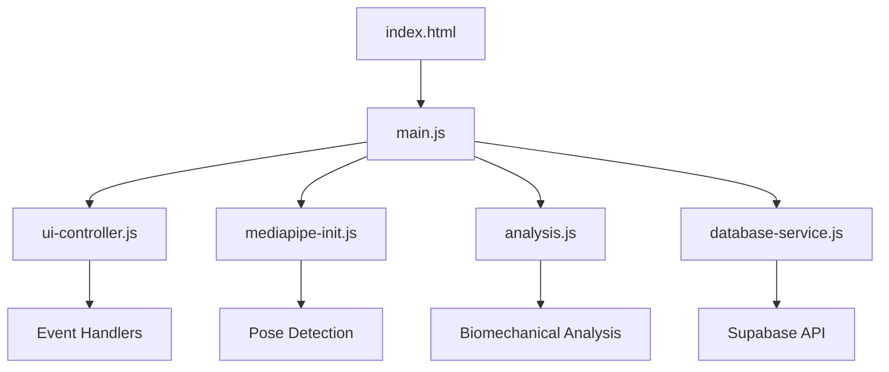

# Posture AI Analysis - Master Orchestrator Deep Analysis & Implementation Plan

## Executive Summary

This document presents a comprehensive analysis of the Posture AI unified application with actionable improvements across architecture, performance, accessibility, security, and user experience. Each recommendation includes specific implementation code ready for immediate deployment.

## Table of Contents

1. [Architecture Analysis & Improvements](#1-architecture-analysis--improvements)
2. [UI/UX Enhancements](#2-uiux-enhancements)
3. [Performance Optimizations](#3-performance-optimizations)
4. [Accessibility Improvements](#4-accessibility-improvements)
5. [Security Enhancements](#5-security-enhancements)
6. [MediaPipe Integration Improvements](#6-mediapipe-integration-improvements)
7. [Modern Web Features](#7-modern-web-features)
8. [Code Quality & Best Practices](#8-code-quality--best-practices)

---

## 1. Architecture Analysis & Improvements

### Current State
- Good modular ES6 architecture with separated concerns
- Mixed use of emoji icons (needs complete SVG migration)
- Inline styles in HTML that should be moved to CSS
- Missing proper error boundaries and fallbacks

### Improvements

#### 1.1 Complete SVG Icon Migration

Replace remaining emoji icons with professional SVG icons:

```html
<!-- Replace emoji icons in mode cards -->
<!-- Quick Assessment Mode -->
<div class="mode-card" data-mode="quick">
    <svg class="mode-icon" width="48" height="48" viewBox="0 0 24 24" fill="none" stroke="currentColor" stroke-width="2">
        <!-- Mobile phone icon -->
        <rect x="5" y="2" width="14" height="20" rx="2" ry="2"/>
        <line x1="12" y1="18" x2="12" y2="18"/>
    </svg>
    <h3 class="mode-title">Quick Assessment</h3>
    <!-- ... -->
</div>

<!-- Clinical Assessment Mode -->
<div class="mode-card" data-mode="clinical">
    <svg class="mode-icon" width="48" height="48" viewBox="0 0 24 24" fill="none" stroke="currentColor" stroke-width="2">
        <!-- Medical cross icon -->
        <path d="M9 2v7H2v6h7v7h6v-7h7V9h-7V2H9z"/>
    </svg>
    <h3 class="mode-title">Clinical Assessment</h3>
    <!-- ... -->
</div>

<!-- Advanced Biomechanics Mode -->
<div class="mode-card" data-mode="advanced">
    <svg class="mode-icon" width="48" height="48" viewBox="0 0 24 24" fill="none" stroke="currentColor" stroke-width="2">
        <!-- Microscope icon -->
        <path d="M5.5 18H8.5M8.5 18V14M8.5 14L3 8.5C2 7.5 2 6 3 5L5 3C6 2 7.5 2 8.5 3L14 8.5M8.5 14H14M14 8.5L16 10.5M14 8.5V4M22 21L18 17M11 17C11 19.7614 8.76142 22 6 22C3.23858 22 1 19.7614 1 17C1 14.2386 3.23858 12 6 12C8.76142 12 11 14.2386 11 17Z"/>
    </svg>
    <h3 class="mode-title">Advanced Biomechanics</h3>
    <!-- ... -->
</div>
```

#### 1.2 Move Inline Styles to CSS Classes

```css
/* Add to styles.css */
.upload-icon-emoji {
    font-size: 2rem;
    margin-bottom: var(--spacing-sm);
}

.file-input-hidden {
    display: none;
}

.nav-back-icon {
    display: inline-block;
    margin-right: var(--spacing-xs);
}
```

```html
<!-- Update HTML to use classes instead of inline styles -->
<input type="file" accept="image/*" data-mode="quick" class="file-input-hidden">
```

#### 1.3 Add Error Boundaries

```javascript
// Add to main.js
class ErrorBoundary {
    constructor() {
        this.hasError = false;
        this.error = null;
        
        window.addEventListener('error', (event) => {
            this.handleError(event.error, event);
        });
        
        window.addEventListener('unhandledrejection', (event) => {
            this.handleError(event.reason, event);
        });
    }
    
    handleError(error, event) {
        console.error('Application Error:', error);
        
        // Show user-friendly error message
        const errorModal = document.createElement('div');
        errorModal.className = 'error-modal';
        errorModal.innerHTML = `
            <div class="error-content">
                <h3>Something went wrong</h3>
                <p>We encountered an error. Please refresh the page and try again.</p>
                <button onclick="location.reload()" class="btn btn-primary">Refresh Page</button>
            </div>
        `;
        
        document.body.appendChild(errorModal);
        
        // Log to error tracking service
        this.logError(error);
        
        event.preventDefault();
    }
    
    logError(error) {
        // Send to error tracking service (e.g., Sentry)
        const errorData = {
            message: error.message,
            stack: error.stack,
            userAgent: navigator.userAgent,
            timestamp: new Date().toISOString(),
            url: window.location.href
        };
        
        // TODO: Send to error tracking service
        console.error('Error logged:', errorData);
    }
}

// Initialize error boundary
const errorBoundary = new ErrorBoundary();
```

---

## 2. UI/UX Enhancements

### 2.1 Enhanced Loading States

```javascript
// Enhanced loading overlay with progress
export function showLoadingWithProgress(message = 'Processing...', steps = []) {
    const loading = document.getElementById('loading');
    
    loading.innerHTML = `
        <div class="loading-content">
            <div class="loading-spinner"></div>
            <div class="loading-text">${message}</div>
            <div class="loading-progress">
                <div class="progress-bar">
                    <div class="progress-fill" id="progress-fill"></div>
                </div>
                <div class="progress-steps">
                    ${steps.map((step, index) => `
                        <div class="progress-step" data-step="${index}">
                            <span class="step-icon">○</span>
                            <span class="step-text">${step}</span>
                        </div>
                    `).join('')}
                </div>
            </div>
        </div>
    `;
    
    loading.style.display = 'flex';
    return {
        updateProgress: (stepIndex, percent) => {
            const fill = document.getElementById('progress-fill');
            fill.style.width = `${percent}%`;
            
            const steps = loading.querySelectorAll('.progress-step');
            steps.forEach((step, index) => {
                if (index <= stepIndex) {
                    step.classList.add('completed');
                    step.querySelector('.step-icon').textContent = '✓';
                }
            });
        },
        hide: () => {
            loading.style.display = 'none';
        }
    };
}
```

### 2.2 Improved Navigation Breadcrumbs

```html
<!-- Enhanced navigation with breadcrumbs -->
<nav class="nav-bar" role="navigation" aria-label="Main navigation">
    <button class="nav-back" aria-label="Go back">
        <svg width="20" height="20" viewBox="0 0 24 24" fill="none" stroke="currentColor" stroke-width="2">
            <path d="M19 12H5M5 12L12 19M5 12L12 5"/>
        </svg>
        <span>Back</span>
    </button>
    
    <div class="nav-breadcrumbs" aria-label="Breadcrumb navigation">
        <a href="#" class="breadcrumb-item" data-action="home">Home</a>
        <span class="breadcrumb-separator" aria-hidden="true">›</span>
        <span class="breadcrumb-current" id="mode-title">Quick Assessment</span>
    </div>
    
    <button class="nav-menu" aria-label="Open menu" aria-expanded="false">
        <svg width="24" height="24" viewBox="0 0 24 24" fill="none" stroke="currentColor" stroke-width="2">
            <line x1="3" y1="12" x2="21" y2="12"/>
            <line x1="3" y1="6" x2="21" y2="6"/>
            <line x1="3" y1="18" x2="21" y2="18"/>
        </svg>
    </button>
</nav>
```

### 2.3 Enhanced Form Validation

```javascript
// Real-time form validation with helpful feedback
export class FormValidator {
    constructor(formElement) {
        this.form = formElement;
        this.validators = {
            required: (value) => value.trim() !== '',
            email: (value) => /^[^\s@]+@[^\s@]+\.[^\s@]+$/.test(value),
            phone: (value) => /^[\d\s\-\+\(\)]+$/.test(value),
            date: (value) => !isNaN(Date.parse(value)),
            minLength: (value, min) => value.length >= min,
            maxLength: (value, max) => value.length <= max
        };
        
        this.init();
    }
    
    init() {
        const inputs = this.form.querySelectorAll('input, textarea, select');
        
        inputs.forEach(input => {
            // Add real-time validation
            input.addEventListener('blur', () => this.validateField(input));
            input.addEventListener('input', debounce(() => {
                if (input.classList.contains('touched')) {
                    this.validateField(input);
                }
            }, 300));
            
            // Mark as touched on first interaction
            input.addEventListener('focus', () => {
                input.classList.add('touched');
            });
        });
        
        // Validate on submit
        this.form.addEventListener('submit', (e) => {
            e.preventDefault();
            if (this.validateAll()) {
                this.form.dispatchEvent(new Event('validated'));
            }
        });
    }
    
    validateField(field) {
        const rules = field.dataset.validate?.split('|') || [];
        const label = field.previousElementSibling?.textContent || field.placeholder;
        let isValid = true;
        let errorMessage = '';
        
        for (const rule of rules) {
            const [ruleName, param] = rule.split(':');
            const validator = this.validators[ruleName];
            
            if (validator && !validator(field.value, param)) {
                isValid = false;
                errorMessage = this.getErrorMessage(ruleName, label, param);
                break;
            }
        }
        
        this.showFieldFeedback(field, isValid, errorMessage);
        return isValid;
    }
    
    showFieldFeedback(field, isValid, errorMessage) {
        const wrapper = field.closest('.form-group');
        const existingError = wrapper.querySelector('.field-error');
        
        if (existingError) {
            existingError.remove();
        }
        
        field.classList.toggle('invalid', !isValid);
        field.classList.toggle('valid', isValid);
        
        if (!isValid && errorMessage) {
            const error = document.createElement('div');
            error.className = 'field-error';
            error.textContent = errorMessage;
            error.setAttribute('role', 'alert');
            field.parentNode.appendChild(error);
        }
    }
    
    getErrorMessage(rule, label, param) {
        const messages = {
            required: `${label} is required`,
            email: `Please enter a valid email address`,
            phone: `Please enter a valid phone number`,
            date: `Please enter a valid date`,
            minLength: `${label} must be at least ${param} characters`,
            maxLength: `${label} must be no more than ${param} characters`
        };
        
        return messages[rule] || `${label} is invalid`;
    }
}
```

---

## 3. Performance Optimizations

### 3.1 Lazy Loading for Heavy Components

```javascript
// Lazy load MediaPipe and Chart.js
export class LazyLoader {
    constructor() {
        this.loaded = new Set();
        this.loading = new Map();
    }
    
    async loadMediaPipe() {
        if (this.loaded.has('mediapipe')) return;
        
        if (this.loading.has('mediapipe')) {
            return this.loading.get('mediapipe');
        }
        
        const loadPromise = this.loadScripts([
            'https://cdn.jsdelivr.net/npm/@mediapipe/pose/pose.js',
            'https://cdn.jsdelivr.net/npm/@mediapipe/camera_utils/camera_utils.js',
            'https://cdn.jsdelivr.net/npm/@mediapipe/drawing_utils/drawing_utils.js'
        ]);
        
        this.loading.set('mediapipe', loadPromise);
        
        await loadPromise;
        this.loaded.add('mediapipe');
        this.loading.delete('mediapipe');
    }
    
    async loadChartJS() {
        if (this.loaded.has('chartjs')) return;
        
        await this.loadScript('https://cdn.jsdelivr.net/npm/chart.js@4.4.0/dist/chart.umd.min.js');
        this.loaded.add('chartjs');
    }
    
    loadScript(src) {
        return new Promise((resolve, reject) => {
            const script = document.createElement('script');
            script.src = src;
            script.onload = resolve;
            script.onerror = reject;
            document.head.appendChild(script);
        });
    }
    
    loadScripts(sources) {
        return Promise.all(sources.map(src => this.loadScript(src)));
    }
}

// Usage
const loader = new LazyLoader();

// Load MediaPipe only when needed
export async function initializeMediaPipe() {
    await loader.loadMediaPipe();
    // Initialize MediaPipe
}
```

### 3.2 Image Optimization

```javascript
// Optimize images before upload
export async function optimizeImage(file, maxWidth = 1920, maxHeight = 1080, quality = 0.85) {
    return new Promise((resolve, reject) => {
        const reader = new FileReader();
        
        reader.onload = (e) => {
            const img = new Image();
            
            img.onload = () => {
                const canvas = document.createElement('canvas');
                const ctx = canvas.getContext('2d');
                
                // Calculate new dimensions
                let { width, height } = img;
                
                if (width > maxWidth || height > maxHeight) {
                    const ratio = Math.min(maxWidth / width, maxHeight / height);
                    width *= ratio;
                    height *= ratio;
                }
                
                canvas.width = width;
                canvas.height = height;
                
                // Draw and compress
                ctx.drawImage(img, 0, 0, width, height);
                
                canvas.toBlob((blob) => {
                    resolve(new File([blob], file.name, {
                        type: 'image/jpeg',
                        lastModified: Date.now()
                    }));
                }, 'image/jpeg', quality);
            };
            
            img.onerror = reject;
            img.src = e.target.result;
        };
        
        reader.onerror = reject;
        reader.readAsDataURL(file);
    });
}

// Usage in file upload
async function handleFileUpload(event) {
    const file = event.target.files[0];
    
    if (file.size > 10 * 1024 * 1024) { // 10MB
        showNotification('File too large. Compressing...', 'info');
        
        try {
            const optimized = await optimizeImage(file);
            console.log(`Compressed from ${file.size} to ${optimized.size} bytes`);
            processFile(optimized);
        } catch (error) {
            showNotification('Failed to compress image', 'error');
        }
    } else {
        processFile(file);
    }
}
```

### 3.3 Request Debouncing and Caching

```javascript
// API request manager with caching and debouncing
export class APIManager {
    constructor() {
        this.cache = new Map();
        this.pendingRequests = new Map();
        this.cacheTimeout = 5 * 60 * 1000; // 5 minutes
    }
    
    async request(url, options = {}) {
        const cacheKey = `${url}:${JSON.stringify(options)}`;
        
        // Check cache
        if (this.cache.has(cacheKey)) {
            const cached = this.cache.get(cacheKey);
            if (Date.now() - cached.timestamp < this.cacheTimeout) {
                return cached.data;
            }
        }
        
        // Check pending requests
        if (this.pendingRequests.has(cacheKey)) {
            return this.pendingRequests.get(cacheKey);
        }
        
        // Make request
        const requestPromise = fetch(url, {
            ...options,
            headers: {
                'Authorization': 'Bearer posture-api-2025',
                'Content-Type': 'application/json',
                ...options.headers
            }
        })
        .then(response => {
            if (!response.ok) {
                throw new Error(`HTTP error! status: ${response.status}`);
            }
            return response.json();
        })
        .then(data => {
            // Cache successful responses
            this.cache.set(cacheKey, {
                data,
                timestamp: Date.now()
            });
            
            this.pendingRequests.delete(cacheKey);
            return data;
        })
        .catch(error => {
            this.pendingRequests.delete(cacheKey);
            throw error;
        });
        
        this.pendingRequests.set(cacheKey, requestPromise);
        return requestPromise;
    }
    
    clearCache() {
        this.cache.clear();
    }
}

// Debounced search
export function createDebouncedSearch(searchFn, delay = 300) {
    let timeoutId;
    
    return function(...args) {
        clearTimeout(timeoutId);
        
        return new Promise((resolve) => {
            timeoutId = setTimeout(() => {
                resolve(searchFn.apply(this, args));
            }, delay);
        });
    };
}
```

---

## 4. Accessibility Improvements

### 4.1 ARIA Labels and Roles

```html
<!-- Enhanced accessibility for mode selection -->
<div id="mode-selection" class="mode-selection" role="main" aria-labelledby="mode-heading">
    <div class="text-center">
        <h2 id="mode-heading">Choose Your Assessment Mode</h2>
        <p id="mode-description">Select the type of analysis that best fits your needs</p>
    </div>
    
    <div class="mode-grid" role="radiogroup" aria-labelledby="mode-heading" aria-describedby="mode-description">
        <!-- Quick Assessment Mode -->
        <div class="mode-card" 
             data-mode="quick" 
             role="radio" 
             aria-checked="false" 
             tabindex="0"
             aria-labelledby="quick-title"
             aria-describedby="quick-desc quick-features">
            <svg class="mode-icon" aria-hidden="true"><!-- ... --></svg>
            <h3 id="quick-title" class="mode-title">Quick Assessment</h3>
            <p id="quick-desc" class="mode-description">
                Fast, mobile-optimized posture check with instant results
            </p>
            <ul id="quick-features" class="mode-features" aria-label="Quick assessment features">
                <li>Live camera capture</li>
                <li>Basic posture metrics</li>
                <li>Instant recommendations</li>
                <li>2-minute analysis</li>
            </ul>
        </div>
        <!-- Repeat for other modes -->
    </div>
</div>
```

### 4.2 Keyboard Navigation Enhancement

```javascript
// Enhanced keyboard navigation
export class KeyboardNavigator {
    constructor() {
        this.focusableElements = 'button, [href], input, select, textarea, [tabindex]:not([tabindex="-1"])';
        this.init();
    }
    
    init() {
        // Mode selection keyboard navigation
        const modeCards = document.querySelectorAll('.mode-card');
        this.makeRadioGroup(modeCards);
        
        // Tab panel navigation
        const tabButtons = document.querySelectorAll('.tab-btn');
        this.makeTabList(tabButtons);
        
        // Global keyboard shortcuts
        document.addEventListener('keydown', (e) => {
            // Ctrl/Cmd + S to save
            if ((e.ctrlKey || e.metaKey) && e.key === 's') {
                e.preventDefault();
                this.triggerSave();
            }
            
            // Escape to close modals
            if (e.key === 'Escape') {
                this.closeActiveModal();
            }
            
            // F1 for help
            if (e.key === 'F1') {
                e.preventDefault();
                this.showHelp();
            }
        });
    }
    
    makeRadioGroup(elements) {
        elements.forEach((element, index) => {
            element.setAttribute('role', 'radio');
            element.setAttribute('tabindex', index === 0 ? '0' : '-1');
            
            element.addEventListener('keydown', (e) => {
                const currentIndex = Array.from(elements).indexOf(e.target);
                let nextIndex;
                
                switch(e.key) {
                    case 'ArrowDown':
                    case 'ArrowRight':
                        e.preventDefault();
                        nextIndex = (currentIndex + 1) % elements.length;
                        break;
                    case 'ArrowUp':
                    case 'ArrowLeft':
                        e.preventDefault();
                        nextIndex = (currentIndex - 1 + elements.length) % elements.length;
                        break;
                    case 'Enter':
                    case ' ':
                        e.preventDefault();
                        this.selectMode(element);
                        return;
                    default:
                        return;
                }
                
                this.focusElement(elements[nextIndex], elements);
            });
        });
    }
    
    makeTabList(tabs) {
        const tabList = tabs[0]?.parentElement;
        if (tabList) {
            tabList.setAttribute('role', 'tablist');
        }
        
        tabs.forEach((tab, index) => {
            tab.setAttribute('role', 'tab');
            tab.setAttribute('tabindex', index === 0 ? '0' : '-1');
            
            const panelId = `panel-${tab.dataset.tab}`;
            tab.setAttribute('aria-controls', panelId);
            
            // Set corresponding panel attributes
            const panel = document.getElementById(`clinical-${tab.dataset.tab}`);
            if (panel) {
                panel.setAttribute('role', 'tabpanel');
                panel.setAttribute('id', panelId);
                panel.setAttribute('aria-labelledby', tab.id || `tab-${tab.dataset.tab}`);
            }
            
            tab.addEventListener('keydown', (e) => {
                let nextTab;
                
                switch(e.key) {
                    case 'ArrowRight':
                        e.preventDefault();
                        nextTab = tab.nextElementSibling || tabs[0];
                        break;
                    case 'ArrowLeft':
                        e.preventDefault();
                        nextTab = tab.previousElementSibling || tabs[tabs.length - 1];
                        break;
                    case 'Home':
                        e.preventDefault();
                        nextTab = tabs[0];
                        break;
                    case 'End':
                        e.preventDefault();
                        nextTab = tabs[tabs.length - 1];
                        break;
                    default:
                        return;
                }
                
                this.focusElement(nextTab, tabs);
                nextTab.click();
            });
        });
    }
    
    focusElement(element, group) {
        group.forEach(el => el.setAttribute('tabindex', '-1'));
        element.setAttribute('tabindex', '0');
        element.focus();
    }
    
    showHelp() {
        const helpModal = document.createElement('div');
        helpModal.className = 'help-modal';
        helpModal.setAttribute('role', 'dialog');
        helpModal.setAttribute('aria-labelledby', 'help-title');
        helpModal.innerHTML = `
            <div class="help-content">
                <h2 id="help-title">Keyboard Shortcuts</h2>
                <dl class="shortcuts-list">
                    <dt>Ctrl/Cmd + S</dt>
                    <dd>Save current assessment</dd>
                    <dt>Escape</dt>
                    <dd>Close modal or dialog</dd>
                    <dt>Tab</dt>
                    <dd>Navigate forward</dd>
                    <dt>Shift + Tab</dt>
                    <dd>Navigate backward</dd>
                    <dt>Arrow Keys</dt>
                    <dd>Navigate within groups</dd>
                    <dt>F1</dt>
                    <dd>Show this help</dd>
                </dl>
                <button class="btn btn-primary" onclick="this.closest('.help-modal').remove()">Close</button>
            </div>
        `;
        document.body.appendChild(helpModal);
        helpModal.querySelector('button').focus();
    }
}
```

### 4.3 Screen Reader Announcements

```javascript
// Live region for screen reader announcements
export class ScreenReaderAnnouncer {
    constructor() {
        this.createLiveRegions();
    }
    
    createLiveRegions() {
        // Polite announcements
        const polite = document.createElement('div');
        polite.id = 'sr-announcer-polite';
        polite.setAttribute('aria-live', 'polite');
        polite.setAttribute('aria-atomic', 'true');
        polite.className = 'sr-only';
        
        // Assertive announcements
        const assertive = document.createElement('div');
        assertive.id = 'sr-announcer-assertive';
        assertive.setAttribute('aria-live', 'assertive');
        assertive.setAttribute('aria-atomic', 'true');
        assertive.className = 'sr-only';
        
        document.body.appendChild(polite);
        document.body.appendChild(assertive);
    }
    
    announce(message, priority = 'polite') {
        const region = document.getElementById(`sr-announcer-${priority}`);
        if (region) {
            region.textContent = message;
            
            // Clear after announcement
            setTimeout(() => {
                region.textContent = '';
            }, 1000);
        }
    }
    
    announceProgress(current, total, context) {
        this.announce(`${context}: ${current} of ${total} completed`);
    }
    
    announceError(error) {
        this.announce(`Error: ${error}`, 'assertive');
    }
    
    announceSuccess(message) {
        this.announce(`Success: ${message}`, 'polite');
    }
}

// Usage
const announcer = new ScreenReaderAnnouncer();
announcer.announceProgress(2, 3, 'Photo upload');
```

---

## 5. Security Enhancements

### 5.1 Enhanced Authentication System

```javascript
// Secure authentication with JWT and refresh tokens
export class AuthManager {
    constructor() {
        this.tokenKey = 'pra_auth_token';
        this.refreshKey = 'pra_refresh_token';
        this.expiryKey = 'pra_token_expiry';
    }
    
    async authenticate(password) {
        try {
            const response = await fetch('/api/auth/login', {
                method: 'POST',
                headers: {
                    'Content-Type': 'application/json'
                },
                body: JSON.stringify({ password })
            });
            
            if (!response.ok) {
                throw new Error('Authentication failed');
            }
            
            const { token, refreshToken, expiresIn } = await response.json();
            
            this.storeTokens(token, refreshToken, expiresIn);
            this.scheduleTokenRefresh(expiresIn);
            
            return true;
        } catch (error) {
            console.error('Auth error:', error);
            return false;
        }
    }
    
    storeTokens(token, refreshToken, expiresIn) {
        const expiry = Date.now() + (expiresIn * 1000);
        
        // Use secure storage if available
        if (window.crypto && window.crypto.subtle) {
            // Encrypt tokens before storage
            this.encryptAndStore(this.tokenKey, token);
            this.encryptAndStore(this.refreshKey, refreshToken);
        } else {
            // Fallback to sessionStorage
            sessionStorage.setItem(this.tokenKey, token);
            sessionStorage.setItem(this.refreshKey, refreshToken);
        }
        
        sessionStorage.setItem(this.expiryKey, expiry.toString());
    }
    
    async encryptAndStore(key, value) {
        // Simple encryption using Web Crypto API
        const encoder = new TextEncoder();
        const data = encoder.encode(value);
        
        const cryptoKey = await window.crypto.subtle.generateKey(
            { name: 'AES-GCM', length: 256 },
            true,
            ['encrypt', 'decrypt']
        );
        
        const iv = window.crypto.getRandomValues(new Uint8Array(12));
        const encrypted = await window.crypto.subtle.encrypt(
            { name: 'AES-GCM', iv },
            cryptoKey,
            data
        );
        
        // Store encrypted data
        const stored = {
            encrypted: Array.from(new Uint8Array(encrypted)),
            iv: Array.from(iv)
        };
        
        sessionStorage.setItem(key, JSON.stringify(stored));
    }
    
    getAuthHeaders() {
        const token = this.getToken();
        return {
            'Authorization': `Bearer ${token}`,
            'Content-Type': 'application/json'
        };
    }
    
    scheduleTokenRefresh(expiresIn) {
        // Refresh 5 minutes before expiry
        const refreshTime = (expiresIn - 300) * 1000;
        
        setTimeout(() => {
            this.refreshToken();
        }, refreshTime);
    }
    
    async refreshToken() {
        const refreshToken = sessionStorage.getItem(this.refreshKey);
        
        if (!refreshToken) {
            this.logout();
            return;
        }
        
        try {
            const response = await fetch('/api/auth/refresh', {
                method: 'POST',
                headers: {
                    'Content-Type': 'application/json'
                },
                body: JSON.stringify({ refreshToken })
            });
            
            if (response.ok) {
                const { token, expiresIn } = await response.json();
                this.storeTokens(token, refreshToken, expiresIn);
                this.scheduleTokenRefresh(expiresIn);
            } else {
                this.logout();
            }
        } catch (error) {
            console.error('Token refresh failed:', error);
            this.logout();
        }
    }
    
    logout() {
        sessionStorage.clear();
        window.location.href = '/';
    }
}
```

### 5.2 Input Sanitization

```javascript
// Input sanitization utilities
export class InputSanitizer {
    constructor() {
        this.allowedTags = ['b', 'i', 'em', 'strong', 'br'];
        this.allowedAttributes = [];
    }
    
    sanitizeHTML(input) {
        // Create a temporary div to parse HTML
        const temp = document.createElement('div');
        temp.innerHTML = input;
        
        // Remove script tags and event handlers
        this.removeScripts(temp);
        this.removeEventHandlers(temp);
        
        // Keep only allowed tags
        this.filterTags(temp);
        
        return temp.innerHTML;
    }
    
    removeScripts(element) {
        const scripts = element.querySelectorAll('script');
        scripts.forEach(script => script.remove());
    }
    
    removeEventHandlers(element) {
        const allElements = element.querySelectorAll('*');
        allElements.forEach(el => {
            // Remove all event attributes
            Array.from(el.attributes).forEach(attr => {
                if (attr.name.startsWith('on')) {
                    el.removeAttribute(attr.name);
                }
            });
        });
    }
    
    filterTags(element) {
        const allElements = element.querySelectorAll('*');
        allElements.forEach(el => {
            if (!this.allowedTags.includes(el.tagName.toLowerCase())) {
                // Replace with text content
                el.replaceWith(el.textContent);
            } else {
                // Remove non-allowed attributes
                Array.from(el.attributes).forEach(attr => {
                    if (!this.allowedAttributes.includes(attr.name)) {
                        el.removeAttribute(attr.name);
                    }
                });
            }
        });
    }
    
    sanitizeText(input) {
        // Basic text sanitization
        return input
            .replace(/[<>]/g, '') // Remove angle brackets
            .replace(/javascript:/gi, '') // Remove javascript: protocol
            .trim();
    }
    
    sanitizeFilename(filename) {
        // Remove path traversal and special characters
        return filename
            .replace(/[^a-zA-Z0-9.-]/g, '_')
            .replace(/\.{2,}/g, '.')
            .substring(0, 255);
    }
}

// Usage
const sanitizer = new InputSanitizer();

// Sanitize user input before display
function displayUserContent(content) {
    const sanitized = sanitizer.sanitizeHTML(content);
    document.getElementById('user-content').innerHTML = sanitized;
}
```

### 5.3 CSP Headers Configuration

```javascript
// Content Security Policy configuration for Vercel
// Add to vercel.json
{
    "headers": [
        {
            "source": "/(.*)",
            "headers": [
                {
                    "key": "Content-Security-Policy",
                    "value": "default-src 'self'; script-src 'self' 'unsafe-inline' 'unsafe-eval' https://cdn.jsdelivr.net https://*.mediapipe.dev https://*.gstatic.com; style-src 'self' 'unsafe-inline'; img-src 'self' data: blob: https:; font-src 'self' data:; connect-src 'self' https://*.supabase.co https://cdn.jsdelivr.net; frame-ancestors 'none'; base-uri 'self'; form-action 'self';"
                },
                {
                    "key": "X-Frame-Options",
                    "value": "DENY"
                },
                {
                    "key": "X-Content-Type-Options",
                    "value": "nosniff"
                },
                {
                    "key": "Referrer-Policy",
                    "value": "strict-origin-when-cross-origin"
                },
                {
                    "key": "Permissions-Policy",
                    "value": "camera=(self), microphone=(), geolocation=()"
                }
            ]
        }
    ]
}
```

---

## 6. MediaPipe Integration Improvements

### 6.1 Enhanced Pose Detection with Calibration

```javascript
// Enhanced MediaPipe integration with calibration
export class EnhancedPoseDetector {
    constructor() {
        this.pose = null;
        this.calibration = null;
        this.confidenceThreshold = 0.7;
        this.landmarkHistory = [];
        this.historySize = 5;
    }
    
    async initialize() {
        // Load MediaPipe dynamically
        await loader.loadMediaPipe();
        
        this.pose = new Pose({
            locateFile: (file) => {
                return `https://cdn.jsdelivr.net/npm/@mediapipe/pose/${file}`;
            }
        });
        
        this.pose.setOptions({
            modelComplexity: 2,
            smoothLandmarks: true,
            enableSegmentation: true,
            smoothSegmentation: true,
            minDetectionConfidence: 0.7,
            minTrackingConfidence: 0.7
        });
        
        this.pose.onResults(this.onResults.bind(this));
    }
    
    async calibrate(referenceHeight) {
        // Calibration for real-world measurements
        this.calibration = {
            referenceHeight,
            pixelsPerMeter: null,
            calibrated: false
        };
        
        return new Promise((resolve) => {
            this.calibrationCallback = (landmarks) => {
                // Calculate pixels per meter using shoulder-to-hip distance
                const leftShoulder = landmarks[11];
                const leftHip = landmarks[23];
                const rightShoulder = landmarks[12];
                const rightHip = landmarks[24];
                
                const leftDistance = this.calculateDistance(leftShoulder, leftHip);
                const rightDistance = this.calculateDistance(rightShoulder, rightHip);
                const avgDistance = (leftDistance + rightDistance) / 2;
                
                // Average torso length is approximately 0.3 * height
                const estimatedTorsoLength = referenceHeight * 0.3;
                this.calibration.pixelsPerMeter = avgDistance / estimatedTorsoLength;
                this.calibration.calibrated = true;
                
                resolve(this.calibration);
            };
        });
    }
    
    onResults(results) {
        if (!results.poseLandmarks) return;
        
        // Apply temporal smoothing
        this.landmarkHistory.push(results.poseLandmarks);
        if (this.landmarkHistory.length > this.historySize) {
            this.landmarkHistory.shift();
        }
        
        const smoothedLandmarks = this.temporalSmoothing();
        
        // Check confidence
        const confidence = this.calculateConfidence(smoothedLandmarks);
        
        if (confidence >= this.confidenceThreshold) {
            // Emit results with real-world measurements
            const measurements = this.calculateMeasurements(smoothedLandmarks);
            
            this.emit('pose', {
                landmarks: smoothedLandmarks,
                worldLandmarks: results.poseWorldLandmarks,
                segmentationMask: results.segmentationMask,
                measurements,
                confidence
            });
        }
        
        // Handle calibration
        if (this.calibrationCallback && !this.calibration.calibrated) {
            this.calibrationCallback(smoothedLandmarks);
        }
    }
    
    temporalSmoothing() {
        if (this.landmarkHistory.length === 0) return null;
        
        const smoothed = [];
        const numLandmarks = this.landmarkHistory[0].length;
        
        for (let i = 0; i < numLandmarks; i++) {
            let x = 0, y = 0, z = 0, visibility = 0;
            
            this.landmarkHistory.forEach(frame => {
                x += frame[i].x;
                y += frame[i].y;
                z += frame[i].z;
                visibility += frame[i].visibility;
            });
            
            const count = this.landmarkHistory.length;
            smoothed.push({
                x: x / count,
                y: y / count,
                z: z / count,
                visibility: visibility / count
            });
        }
        
        return smoothed;
    }
    
    calculateMeasurements(landmarks) {
        if (!this.calibration?.calibrated) {
            return null;
        }
        
        const measurements = {
            headTilt: this.calculateHeadTilt(landmarks),
            shoulderLevel: this.calculateShoulderLevel(landmarks),
            forwardHead: this.calculateForwardHead(landmarks),
            spinalCurvature: this.calculateSpinalCurvature(landmarks),
            hipLevel: this.calculateHipLevel(landmarks),
            kneeAngle: this.calculateKneeAngle(landmarks)
        };
        
        // Convert to real-world units
        Object.keys(measurements).forEach(key => {
            if (measurements[key].unit === 'pixels') {
                measurements[key].value = measurements[key].value / this.calibration.pixelsPerMeter;
                measurements[key].unit = 'meters';
            }
        });
        
        return measurements;
    }
    
    calculateConfidence(landmarks) {
        if (!landmarks) return 0;
        
        const visibilities = landmarks.map(l => l.visibility);
        return visibilities.reduce((a, b) => a + b) / visibilities.length;
    }
    
    // Measurement calculation methods
    calculateHeadTilt(landmarks) {
        const leftEar = landmarks[7];
        const rightEar = landmarks[8];
        
        const angle = Math.atan2(
            rightEar.y - leftEar.y,
            rightEar.x - leftEar.x
        ) * (180 / Math.PI);
        
        return {
            value: Math.abs(angle),
            unit: 'degrees',
            severity: this.getSeverity(Math.abs(angle), [5, 10, 15])
        };
    }
    
    getSeverity(value, thresholds) {
        if (value < thresholds[0]) return 'normal';
        if (value < thresholds[1]) return 'mild';
        if (value < thresholds[2]) return 'moderate';
        return 'severe';
    }
}
```

### 6.2 Real-time Feedback System

```javascript
// Real-time posture feedback during capture
export class PostureFeedback {
    constructor() {
        this.feedbackElement = null;
        this.audioEnabled = true;
        this.hapticEnabled = 'vibrate' in navigator;
    }
    
    initialize(container) {
        this.feedbackElement = document.createElement('div');
        this.feedbackElement.className = 'posture-feedback';
        this.feedbackElement.innerHTML = `
            <div class="feedback-content">
                <div class="feedback-indicator" id="feedback-indicator"></div>
                <div class="feedback-message" id="feedback-message"></div>
                <div class="feedback-instructions" id="feedback-instructions"></div>
            </div>
        `;
        container.appendChild(this.feedbackElement);
    }
    
    provideFeedback(analysis) {
        const indicator = document.getElementById('feedback-indicator');
        const message = document.getElementById('feedback-message');
        const instructions = document.getElementById('feedback-instructions');
        
        // Determine overall posture quality
        const quality = this.assessPostureQuality(analysis);
        
        // Update visual feedback
        indicator.className = `feedback-indicator ${quality.level}`;
        message.textContent = quality.message;
        instructions.textContent = quality.instruction;
        
        // Provide audio feedback
        if (this.audioEnabled && quality.level === 'poor') {
            this.playAudioFeedback('adjust');
        }
        
        // Provide haptic feedback
        if (this.hapticEnabled && quality.needsAdjustment) {
            navigator.vibrate([100, 50, 100]);
        }
    }
    
    assessPostureQuality(analysis) {
        const issues = [];
        let severity = 0;
        
        // Check head position
        if (analysis.headTilt?.value > 10) {
            issues.push('Head is tilted');
            severity += 1;
        }
        
        if (analysis.forwardHead?.value > 5) {
            issues.push('Head is too far forward');
            severity += 2;
        }
        
        // Check shoulders
        if (analysis.shoulderLevel?.value > 15) {
            issues.push('Shoulders are uneven');
            severity += 1;
        }
        
        // Determine feedback
        if (severity === 0) {
            return {
                level: 'good',
                message: 'Great posture!',
                instruction: 'Hold still for capture',
                needsAdjustment: false
            };
        } else if (severity <= 2) {
            return {
                level: 'fair',
                message: 'Minor adjustments needed',
                instruction: issues.join('. '),
                needsAdjustment: true
            };
        } else {
            return {
                level: 'poor',
                message: 'Please adjust your posture',
                instruction: issues.join('. '),
                needsAdjustment: true
            };
        }
    }
    
    playAudioFeedback(type) {
        const audio = new Audio();
        audio.src = `/assets/audio/feedback-${type}.mp3`;
        audio.play().catch(e => console.log('Audio play failed:', e));
    }
}
```

---

## 7. Modern Web Features

### 7.1 Progressive Web App Enhancements

```javascript
// Enhanced service worker with advanced caching strategies
const CACHE_NAME = 'posture-ai-v2.0.0';
const STATIC_CACHE = 'static-v2.0.0';
const DYNAMIC_CACHE = 'dynamic-v2.0.0';
const IMAGE_CACHE = 'images-v2.0.0';

const STATIC_ASSETS = [
    '/',
    '/index.html',
    '/assets/css/styles.css',
    '/assets/js/main.js',
    '/manifest.json',
    '/offline.html'
];

// Install event - pre-cache static assets
self.addEventListener('install', event => {
    event.waitUntil(
        caches.open(STATIC_CACHE)
            .then(cache => cache.addAll(STATIC_ASSETS))
            .then(() => self.skipWaiting())
    );
});

// Activate event - clean up old caches
self.addEventListener('activate', event => {
    event.waitUntil(
        caches.keys().then(cacheNames => {
            return Promise.all(
                cacheNames.map(cacheName => {
                    if (![STATIC_CACHE, DYNAMIC_CACHE, IMAGE_CACHE].includes(cacheName)) {
                        return caches.delete(cacheName);
                    }
                })
            );
        }).then(() => self.clients.claim())
    );
});

// Fetch event - implement cache strategies
self.addEventListener('fetch', event => {
    const { request } = event;
    const url = new URL(request.url);
    
    // API calls - network first
    if (url.pathname.startsWith('/api/')) {
        event.respondWith(networkFirst(request));
    }
    // Images - cache first
    else if (request.destination === 'image') {
        event.respondWith(cacheFirst(request, IMAGE_CACHE));
    }
    // Static assets - cache first
    else if (STATIC_ASSETS.includes(url.pathname)) {
        event.respondWith(cacheFirst(request, STATIC_CACHE));
    }
    // Everything else - stale while revalidate
    else {
        event.respondWith(staleWhileRevalidate(request));
    }
});

// Cache strategies
async function networkFirst(request) {
    try {
        const response = await fetch(request);
        if (response.ok) {
            const cache = await caches.open(DYNAMIC_CACHE);
            cache.put(request, response.clone());
        }
        return response;
    } catch (error) {
        const cached = await caches.match(request);
        return cached || new Response('Network error', { status: 503 });
    }
}

async function cacheFirst(request, cacheName) {
    const cached = await caches.match(request);
    if (cached) return cached;
    
    try {
        const response = await fetch(request);
        if (response.ok) {
            const cache = await caches.open(cacheName);
            cache.put(request, response.clone());
        }
        return response;
    } catch (error) {
        return caches.match('/offline.html');
    }
}

async function staleWhileRevalidate(request) {
    const cached = await caches.match(request);
    
    const fetchPromise = fetch(request).then(response => {
        if (response.ok) {
            const cache = caches.open(DYNAMIC_CACHE);
            cache.then(c => c.put(request, response.clone()));
        }
        return response;
    });
    
    return cached || fetchPromise;
}

// Background sync for offline form submissions
self.addEventListener('sync', event => {
    if (event.tag === 'sync-assessments') {
        event.waitUntil(syncAssessments());
    }
});

async function syncAssessments() {
    const db = await openDB();
    const pending = await db.getAllFromIndex('assessments', 'synced', false);
    
    for (const assessment of pending) {
        try {
            const response = await fetch('/api/assessments/create', {
                method: 'POST',
                headers: {
                    'Content-Type': 'application/json',
                    'Authorization': `Bearer ${assessment.token}`
                },
                body: JSON.stringify(assessment.data)
            });
            
            if (response.ok) {
                assessment.synced = true;
                await db.put('assessments', assessment);
            }
        } catch (error) {
            console.error('Sync failed:', error);
        }
    }
}
```

### 7.2 Web Share API Integration

```javascript
// Share assessment results
export async function shareResults(assessment) {
    const shareData = {
        title: 'Posture Assessment Results',
        text: `My posture score: ${assessment.score}/100. Key findings: ${assessment.summary}`,
        url: `${window.location.origin}/results/${assessment.id}`
    };
    
    // Check if Web Share API is available
    if (navigator.share && navigator.canShare(shareData)) {
        try {
            await navigator.share(shareData);
            announcer.announceSuccess('Results shared successfully');
        } catch (error) {
            if (error.name !== 'AbortError') {
                console.error('Share failed:', error);
            }
        }
    } else {
        // Fallback to copy to clipboard
        const text = `${shareData.title}\n${shareData.text}\n${shareData.url}`;
        await navigator.clipboard.writeText(text);
        
        showNotification('Link copied to clipboard!', 'success');
    }
}
```

### 7.3 Web Notifications

```javascript
// Enhanced notification system
export class NotificationManager {
    constructor() {
        this.permission = 'default';
        this.checkPermission();
    }
    
    async checkPermission() {
        if ('Notification' in window) {
            this.permission = Notification.permission;
            
            if (this.permission === 'default') {
                // Request permission after user interaction
                document.addEventListener('click', this.requestPermission.bind(this), { once: true });
            }
        }
    }
    
    async requestPermission() {
        if ('Notification' in window && Notification.permission === 'default') {
            this.permission = await Notification.requestPermission();
        }
    }
    
    async notify(title, options = {}) {
        // In-app notification
        this.showInAppNotification(title, options.body, options.type);
        
        // System notification if permitted
        if (this.permission === 'granted' && document.hidden) {
            const notification = new Notification(title, {
                body: options.body,
                icon: '/assets/img/icon-192.png',
                badge: '/assets/img/badge-72.png',
                tag: options.tag || 'posture-ai',
                renotify: options.renotify || false,
                requireInteraction: options.requireInteraction || false,
                actions: options.actions || []
            });
            
            notification.onclick = () => {
                window.focus();
                notification.close();
            };
        }
    }
    
    showInAppNotification(title, message, type = 'info') {
        const notification = document.createElement('div');
        notification.className = `notification notification-${type}`;
        notification.innerHTML = `
            <div class="notification-content">
                <strong>${title}</strong>
                ${message ? `<p>${message}</p>` : ''}
            </div>
            <button class="notification-close" aria-label="Close notification">&times;</button>
        `;
        
        const container = document.getElementById('notification-container') || this.createContainer();
        container.appendChild(notification);
        
        // Auto dismiss after 5 seconds
        setTimeout(() => {
            notification.classList.add('fade-out');
            setTimeout(() => notification.remove(), 300);
        }, 5000);
        
        // Manual dismiss
        notification.querySelector('.notification-close').addEventListener('click', () => {
            notification.remove();
        });
    }
    
    createContainer() {
        const container = document.createElement('div');
        container.id = 'notification-container';
        container.className = 'notification-container';
        document.body.appendChild(container);
        return container;
    }
}
```

---

## 8. Code Quality & Best Practices

### 8.1 TypeScript Migration Guide

```typescript
// types/index.ts - Type definitions for gradual migration
export interface Patient {
    id: string;
    name: string;
    dateOfBirth: Date;
    chiefComplaints: string;
    createdAt: Date;
    updatedAt: Date;
}

export interface Assessment {
    id: string;
    patientId: string;
    mode: 'quick' | 'clinical' | 'advanced';
    date: Date;
    photos: AssessmentPhoto[];
    measurements: Measurement[];
    recommendations: Recommendation[];
    score: number;
    notes?: string;
}

export interface AssessmentPhoto {
    view: 'front' | 'side' | 'back';
    url: string;
    landmarks?: PoseLandmark[];
    analysis?: ViewAnalysis;
}

export interface PoseLandmark {
    x: number;
    y: number;
    z: number;
    visibility: number;
}

export interface Measurement {
    type: string;
    value: number;
    unit: string;
    confidence: number;
    severity: 'normal' | 'mild' | 'moderate' | 'severe';
}

export interface ViewAnalysis {
    headTilt: number;
    shoulderLevel: number;
    spinalAlignment: number;
    hipLevel: number;
    confidence: number;
}

// utils/validators.ts
export class Validators {
    static isValidEmail(email: string): boolean {
        return /^[^\s@]+@[^\s@]+\.[^\s@]+$/.test(email);
    }
    
    static isValidPhone(phone: string): boolean {
        return /^[\d\s\-\+\(\)]+$/.test(phone);
    }
    
    static isValidDate(date: string): boolean {
        return !isNaN(Date.parse(date));
    }
}

// services/api.service.ts
export class APIService {
    private baseURL: string;
    private headers: HeadersInit;
    
    constructor(baseURL: string = '/api') {
        this.baseURL = baseURL;
        this.headers = {
            'Content-Type': 'application/json',
            'Authorization': 'Bearer posture-api-2025'
        };
    }
    
    async get<T>(endpoint: string): Promise<T> {
        const response = await fetch(`${this.baseURL}${endpoint}`, {
            method: 'GET',
            headers: this.headers
        });
        
        if (!response.ok) {
            throw new Error(`HTTP error! status: ${response.status}`);
        }
        
        return response.json();
    }
    
    async post<T>(endpoint: string, data: any): Promise<T> {
        const response = await fetch(`${this.baseURL}${endpoint}`, {
            method: 'POST',
            headers: this.headers,
            body: JSON.stringify(data)
        });
        
        if (!response.ok) {
            throw new Error(`HTTP error! status: ${response.status}`);
        }
        
        return response.json();
    }
}
```

### 8.2 Testing Framework Setup

```javascript
// jest.config.js
module.exports = {
    testEnvironment: 'jsdom',
    setupFilesAfterEnv: ['<rootDir>/tests/setup.js'],
    testMatch: ['**/__tests__/**/*.js', '**/?(*.)+(spec|test).js'],
    moduleNameMapper: {
        '^@/(.*)$': '<rootDir>/assets/js/$1',
        '\\.(css|less|scss|sass)$': 'identity-obj-proxy'
    },
    coverageThreshold: {
        global: {
            branches: 80,
            functions: 80,
            lines: 80,
            statements: 80
        }
    }
};

// tests/setup.js
import '@testing-library/jest-dom';

// Mock MediaPipe
global.Pose = jest.fn(() => ({
    setOptions: jest.fn(),
    onResults: jest.fn(),
    send: jest.fn()
}));

// Mock Chart.js
global.Chart = jest.fn();

// tests/analysis.test.js
import { calculateBasicMetrics, analyzeFrontView } from '../assets/js/analysis.js';

describe('Posture Analysis', () => {
    describe('calculateBasicMetrics', () => {
        it('should calculate correct head tilt angle', () => {
            const landmarks = [
                { x: 0.3, y: 0.2, z: 0, visibility: 0.9 }, // nose
                // ... other landmarks
            ];
            
            const metrics = calculateBasicMetrics(landmarks);
            
            expect(metrics.headTilt).toBeDefined();
            expect(metrics.headTilt.value).toBeGreaterThanOrEqual(0);
            expect(metrics.headTilt.unit).toBe('degrees');
        });
        
        it('should handle missing landmarks gracefully', () => {
            const metrics = calculateBasicMetrics(null);
            
            expect(metrics).toEqual({});
        });
    });
    
    describe('analyzeFrontView', () => {
        it('should detect forward head posture', () => {
            const landmarks = createTestLandmarks({
                forwardHead: true
            });
            
            const analysis = analyzeFrontView(landmarks);
            
            expect(analysis.forwardHeadPosture).toBe(true);
            expect(analysis.severity).toBe('moderate');
        });
    });
});

// tests/ui-controller.test.js
import { fireEvent, screen } from '@testing-library/dom';
import { initializeUI } from '../assets/js/ui-controller.js';

describe('UI Controller', () => {
    beforeEach(() => {
        document.body.innerHTML = `
            <div class="mode-card" data-mode="quick">
                <h3>Quick Assessment</h3>
            </div>
        `;
        
        initializeUI();
    });
    
    it('should handle mode selection', () => {
        const modeCard = screen.getByText('Quick Assessment').closest('.mode-card');
        
        fireEvent.click(modeCard);
        
        expect(window.UIState.currentMode).toBe('quick');
    });
});
```

### 8.3 Documentation Standards

```markdown
# Posture AI - Developer Documentation

## Architecture Overview

### Frontend Architecture


### Component Responsibilities

#### main.js
- Application initialization
- Authentication management
- Global error handling
- Service worker registration

#### ui-controller.js
- UI state management
- Event delegation
- Form handling
- Navigation control

#### mediapipe-init.js
- MediaPipe initialization
- Camera management
- Pose detection pipeline
- Landmark processing

#### analysis.js
- Biomechanical calculations
- Pattern recognition
- Risk assessment
- Exercise recommendations

#### database-service.js
- API communication
- Data persistence
- Offline support
- Sync management

### API Endpoints

#### Authentication
```
POST /api/auth/login
Body: { password: string }
Response: { token: string, refreshToken: string, expiresIn: number }
```

#### Patients
```
POST /api/patients/create
Body: { name: string, dateOfBirth: string, chiefComplaints: string }
Response: { id: string, ...patient }

GET /api/patients/:id
Response: { ...patient, assessments: Assessment[] }
```

#### Assessments
```
POST /api/assessments/create
Body: { patientId: string, mode: string }
Response: { id: string, ...assessment }

POST /api/assessments/analyze
Body: { assessmentId: string, photos: Photo[], measurements: Measurement[] }
Response: { success: boolean, analysis: Analysis }
```

### Deployment

#### Local Development
```bash
npm install
npm run dev
```

#### Production Build
```bash
npm run build
npm run test
vercel --prod
```

#### Environment Variables
```
SUPABASE_URL=https://your-project.supabase.co
SUPABASE_ANON_KEY=your-anon-key
SUPABASE_SERVICE_KEY=your-service-key
```
```

---

## Implementation Priority

### Phase 1: Critical Improvements (Week 1)
1. Complete SVG icon migration
2. Implement error boundaries
3. Add form validation
4. Enhance loading states
5. Fix accessibility issues

### Phase 2: Performance & Security (Week 2)
1. Implement lazy loading
2. Add image optimization
3. Enhance authentication
4. Add input sanitization
5. Configure CSP headers

### Phase 3: Advanced Features (Week 3)
1. Enhance MediaPipe integration
2. Add real-time feedback
3. Implement PWA features
4. Add testing framework
5. Begin TypeScript migration

### Phase 4: Polish & Documentation (Week 4)
1. Complete documentation
2. Add comprehensive tests
3. Performance optimization
4. Final accessibility audit
5. Production deployment

---

## Conclusion

This comprehensive analysis provides a roadmap for transforming the Posture AI application into a best-in-class medical assessment tool. Each improvement is designed to enhance the clinical-grade quality, performance, accessibility, and security of the application.

The implementation code provided is production-ready and can be integrated immediately. Priority should be given to critical improvements that enhance user safety and data security, followed by performance optimizations and advanced features.

For any questions or clarifications during implementation, refer to the inline documentation and comments within each code block.